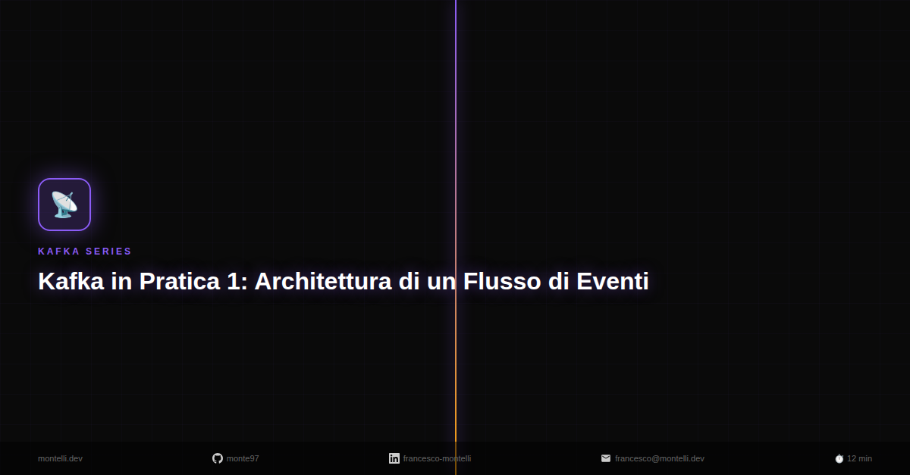
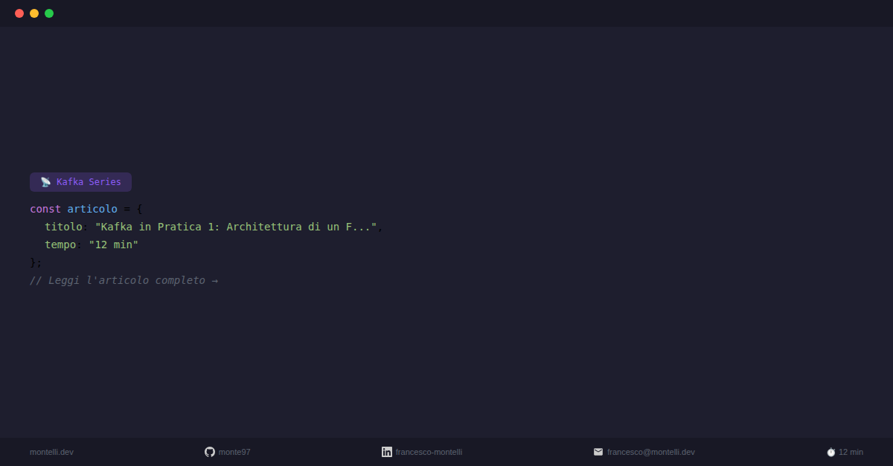
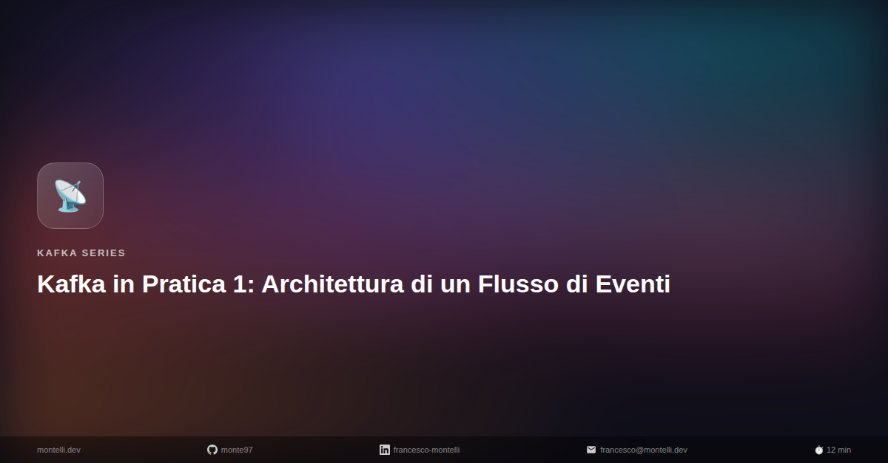
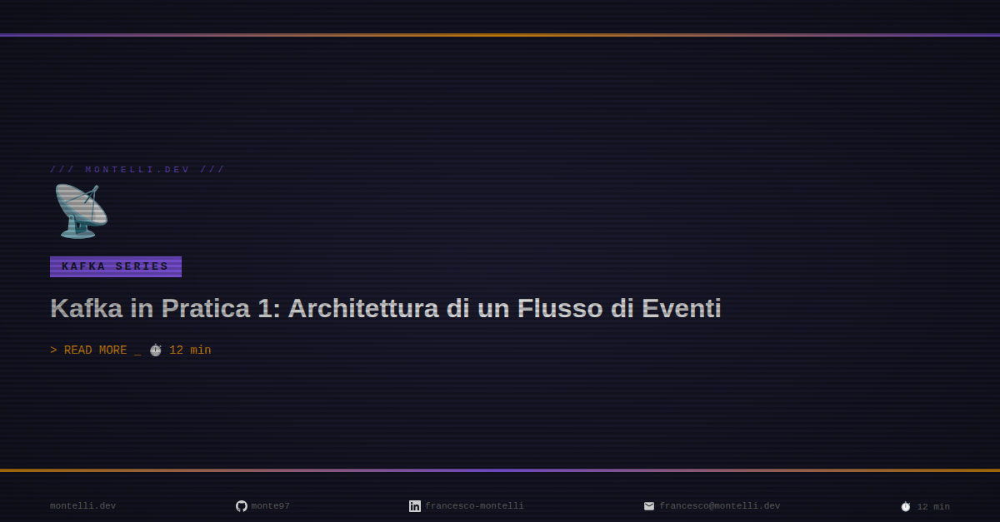
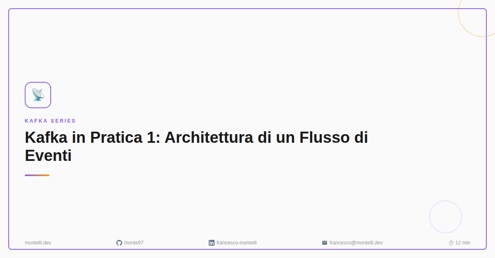

# Cover Generator

Automated cover image generation for blog posts and LinkedIn — 16 Handlebars templates, category-aware colors, social footer. Fork it, edit `config.js`, done.

Built with [Playwright](https://playwright.dev/) + [Handlebars](https://handlebarsjs.com/) + Chromium.

## Quick Start

```bash
npm install && npm run install-browser
npm run gen -- content/posts/kafka/01-intro --template dark
```

Or with Make (works from any directory):

```bash
make install
make gen POST=content/posts/kafka/01-intro TEMPLATE=dark
```

## Configuration

Edit **`config.js`** — it's the only file you need to touch:

```js
module.exports = {
    brand: 'yourdomain.dev',
    social: { github: 'you', linkedin: 'you', email: 'you@example.com' },
    defaults: { template: 'minimal', format: 'both', outputDir: '...', contentDir: '...' },
    categories: {
        'python': { colors: ['#3776AB', '#FFD43B'], icon: '🐍', label: 'Python' },
        'devops': { colors: ['#4F46E5', '#7C3AED'], icon: '🚀', label: 'DevOps' },
        'default': { colors: ['#475569', '#94A3B8'], icon: '📝', label: 'Article' },
    },
    titleKeywords: { 'django': 'python', 'docker': 'devops' },
};
```

Categories are auto-detected from directory path, tags, title keywords, or frontmatter categories.

## Templates

Each template is a `.hbs` file in `templates/`. Previews at LinkedIn size (1200x627):

### Generative (default — `gen-random` picks one per article)

| | | |
|:---:|:---:|:---:|
|  |  |  |
| `gen-flow` | `gen-geo` | `gen-circles` |

### Static

| | | |
|:---:|:---:|:---:|
|  |  |  |
| `minimal` | `dark` | `split` |
|  |  |  |
| `glass` | `neon` | `magazine` |
|  |  |  |
| `code` | `mesh` | `terminal` |
|  |  |  |
| `polaroid` | `blueprint` | `duotone` |
|  |  |  |
| `retro` | `wave` | `outline` |
|  | | |
| `stack` | | |

## Creating a New Template

```bash
make new-template NAME=my-theme    # creates templates/my-theme.hbs from scaffold
make gen POST=content/posts/kafka/01-intro TEMPLATE=my-theme
```

A template is a self-contained HTML document:

```
{{!-- name: My Theme --}}           ← display name (first line)
<html>
<head><style>/* your CSS */</style></head>
<body>
  <div class="cover">
    {{categoryLabel}} · {{title}}   ← Handlebars variables
    {{> social-footer theme="dark"}} ← shared partial
  </div>
</body>
</html>
```

Available variables: `title`, `categoryLabel`, `icon`, `colors.[0]`/`colors.[1]`, `brand`, `social.*`, `readTime`, `width`, `height`

Helpers: `{{hexToRgb color}}` `{{truncate str len}}` `{{#if (eq a b)}}`

## Commands

| Command | Description |
|:--------|:------------|
| `make gen POST=... [TEMPLATE=...] [FORMAT=...]` | Generate cover for one article |
| `make all SERIES=... [TEMPLATE=...] [FORMAT=...]` | Batch generate for a series |
| `make export` | Regenerate HTML + PNG previews |
| `make new-template NAME=...` | Scaffold a new template |
| `make list-templates` | List available templates |
| `make list-series` | List available series |
| `make install` | Install deps + Playwright browser |
| `make clean` | Remove generated output |

Output formats: **linkedin** (1200x627) and **blog** (1280x720). Default: both.

## Project Structure

```
config.js              # Edit this — branding, categories, defaults
templates/
  *.hbs                # 16 templates (auto-discovered)
  _scaffold.hbs        # Scaffold for new templates (ignored)
  partials/            # Shared Handlebars partials
  examples/            # Generated HTML + PNG previews
index.js               # CLI: single article → PNG
generate-all.js        # CLI: batch series → PNGs
export-templates.js    # CLI: export previews (--html-only to skip PNGs)
lib/                   # Template loader, frontmatter parser, category detection
```

## License

MIT
